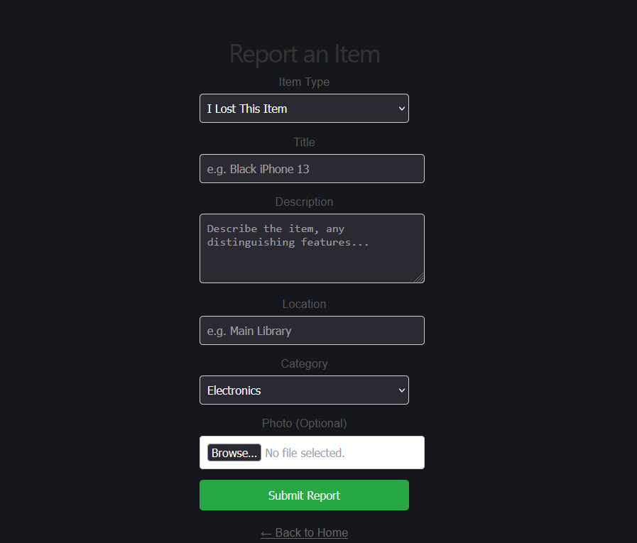
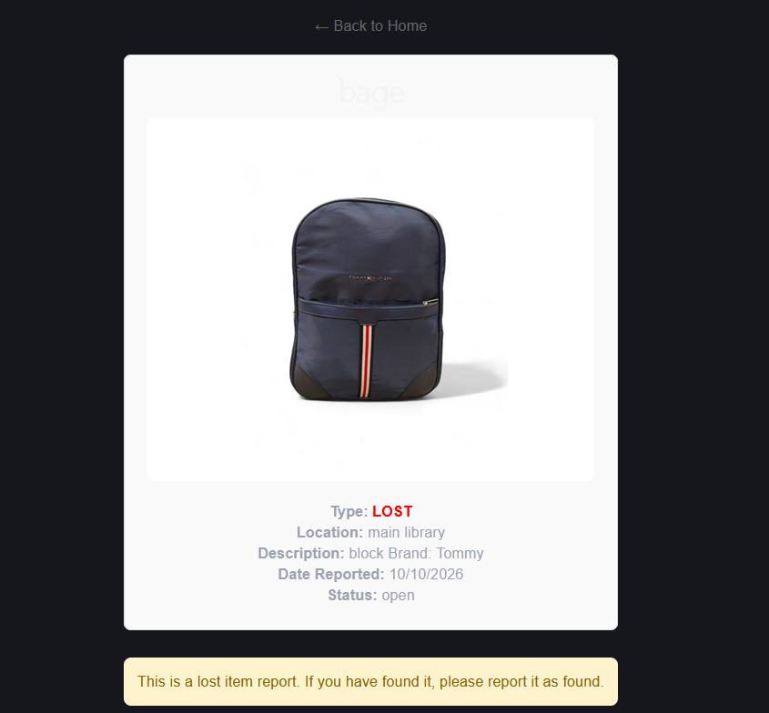
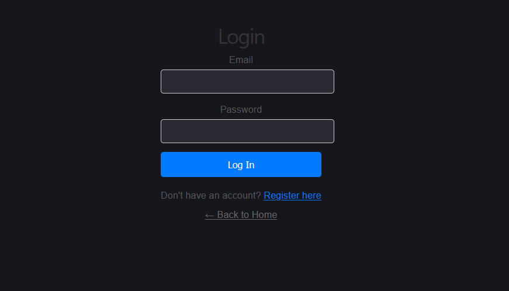
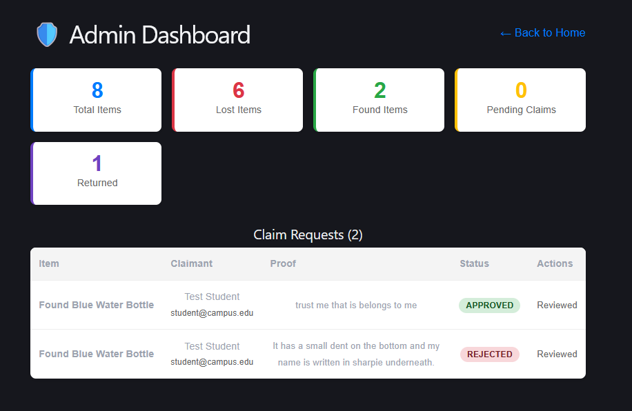
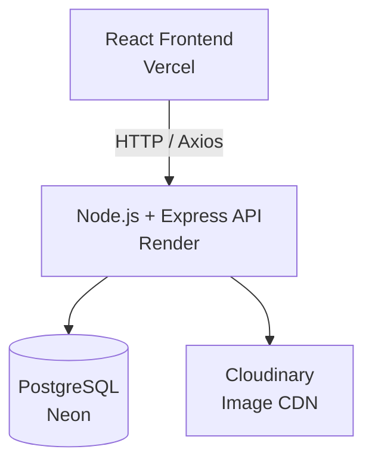

# 🎓 Campus Lost & Found + Item Recovery Platform

A full-stack web application that helps university students report lost items, post found items, and reunite people with their belongings. Includes a complete admin dashboard for campus security to verify claims.

## 🌐 Live Demo

- **Frontend:** [campus-lost-and-found-snowy.vercel.app](https://campus-lost-and-found-snowy.vercel.app)
- **Backend API:** [campus-lost-and-found-api-y6d2.onrender.com](https://campus-lost-and-found-api-y6d2.onrender.com)

> ⏰ **Note:** The backend is hosted on Render's free tier, so it may take up to 60 seconds to "wake up" on the first request.

---
## 📸 Screenshots

### 🏠 Home Page


### 📝 Report an Item


### 📋 Item Details & Claim Submission


### 🔐 Login


### 🛡️ Admin Dashboard


---
## ✨ Features


### 👨‍🎓 For Students
- 🔐 **Secure authentication** with JWT tokens and hashed passwords (bcrypt)
- 📸 **Report lost or found items** with photo uploads (Cloudinary)
- 🔍 **Browse and filter** all reported items
- 📋 **Submit claims** with proof of ownership for found items
- 🖼️ **View detailed item pages** with images, descriptions, and locations

### 🛡️ For Admins
- 📊 **Live dashboard stats** (total items, lost, found, pending claims, returned)
- ✅ **Review and approve/reject** claim requests
- 🔄 **Auto-resolve items** when a claim is approved
- 🔒 **Role-based access control** — admin-only routes

---

## 🛠️ Tech Stack

| Layer | Technology |
| :--- | :--- |
| **Frontend** | React + Vite, React Router, Axios |
| **Backend** | Node.js, Express, TypeScript |
| **Database** | PostgreSQL (Neon) |
| **Auth** | JWT + bcryptjs |
| **File Storage** | Cloudinary |
| **Frontend Hosting** | Vercel |
| **Backend Hosting** | Render |

---
## 🏗️ Architecture



---

## 🚀 Getting Started (Local Development)

### Prerequisites
- Node.js (v18+)
- PostgreSQL database (or a free Neon account)
- Cloudinary account (free tier)

### 1. Clone the Repository
```bash
git clone https://github.com/Shebawu/campus-lost-and-found.git
cd campus-lost-and-found
